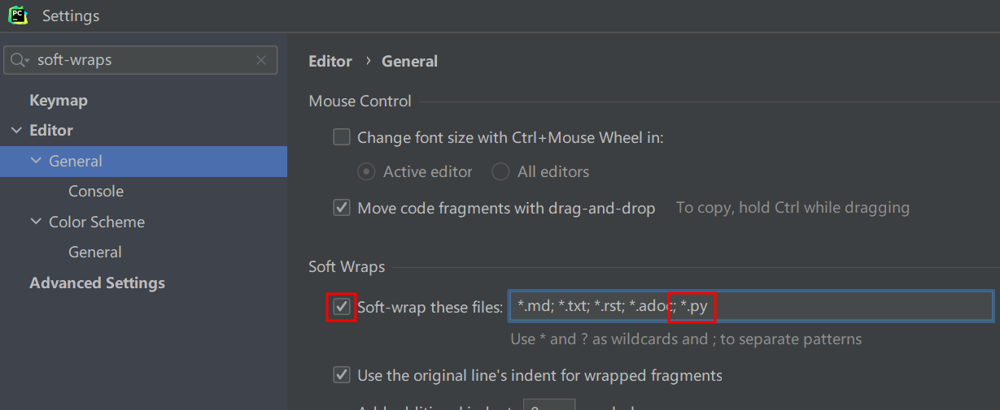
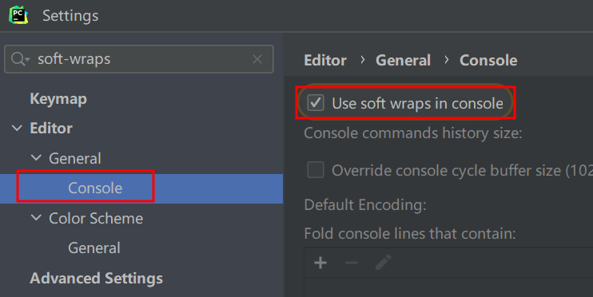

# Pycharm的基本设置

## 设置自动换行/折行
按`ctrl`+`alt`+`s`,打开设置

在左上角搜索框中输入`soft-wraps`，打到editor-General,勾选`soft-wrap these files`,然后在最后添加`; *.py`。
  

找到editor-General-Console,勾选`Use soft wraps in console`,启用控制台的自动折行功能
  

## 行号栏过宽

按`ctrl`+`alt`+`s`,打开设置

在左上角搜索框中输入`show gutter icons`，然后**取消勾选**`show gutter icons`即可。

## 跳出成对的括号

在输入`' '`、`" "`、`()`等成对的括号后，如果想跳出当前括号，可以再按一下当前的括号即可跳出括号。

例如输入`''`后，再输入`abcde`,此时光标是处于`e`的后面、`'`的前面。

此时再按一下`'`，即可跳到`'`的后面了。

