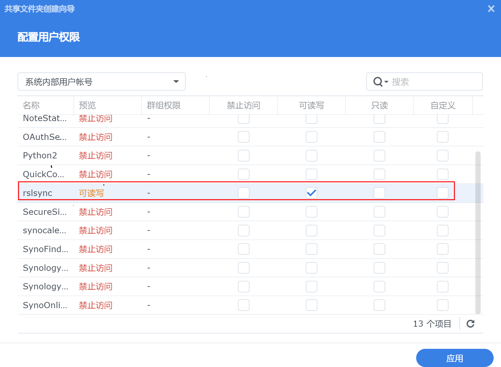

# 在群晖DSM7上安装ResilioSync

## 安装

在DSM 7的`套件中心`里，有官方的resilio sync套件，直接安装即可。

## 权限设置

这里应该是DSM 7上设置resilio sync的难点了。

如果直接在resilio sync的`Web UI`里设置`默认文件夹位置`和`文件下载位置`,会发现无论选择哪个文件夹，都会提示没有权限。

这个问题是由于resilio sync的用户权限造成的。

在DSM 7里，resilio sync创建并使用`rslsync`这个用户。因此`rslsync`这个用户必须对同步文件夹有读写权限。

正确的方法是：
1. 打开`控制面板`--`共享文件夹`，点击左上角`新增`
2. 新建一个文件夹，假设名字是`resiliosync`，根据向导一步步来。
3. 在`配置用户权限`这一步，点击左上角，选择`系统内部用户账号`，找到`rslsync`，选中`可读写`。
4. 在resilio sync的Web UI里，`默认文件夹位置`和`文件下载位置`设置为`resiliosync`即可。

