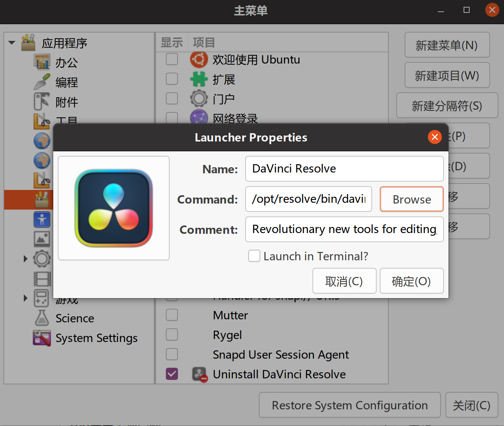

# Davinci在linux下的HiDPI分辨率的问题

我的显示器是27寸4K的分辨率。

在ubuntu下安装完davinci resolve 18后，发现启动后界面字体变得非常小，除了`鹰眼`我相信没人能看得清。

很明显，这是个Linux下的UI缩放的问题。

## 解决方法

网上一番搜索，找到了问题的[解决方法](https://www.reallinuxuser.com/how-to-set-up-davinci-resolve-for-high-resolution-displays-in-linux/)：

原理很简单，就是给davinci的启动程序添加几个参数，如下：
```
QT_DEVICE_PIXEL_RATIO=3 QT_AUTO_SCREEN_SCALE_FACTOR=true ./resolve
```
解释一下：
QT_DEVICE_PIXEL_RATIO=`3`，最后这个`3`是放大的倍数，即放大`300%`。

如果是原始分辨率的话，这里设置为`2`就可以了。

但是如果已经调整过缩放了，比如我在ubuntu下已经设置为`150%`的缩放，这里设置为`3`比较合适。

## 添加到启动器

ubuntu可以使用`alacarte`这个软件编辑启动菜单。
```
sudo apt install alacarte
```

在davinci的安装目录`/opt/resolve/bin`下的新建一个文件`davinci.sh`，内容如下：
```
#!/bin/sh

cd /opt/resolve/bin && QT_DEVICE_PIXEL_RATIO=3 QT_AUTO_SCREEN_SCALE_FACTOR=true ./resolve
```
添加可执行权限：
```
sudo chmod +x davinci.sh
```
运行`alacarte`，找到`davinci`的菜单项，点击`属性`--`Browser`，选中`davinci.sh`，保存即可。
  

