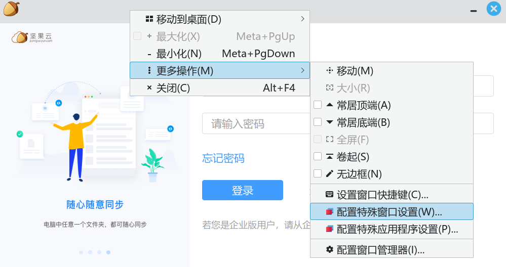
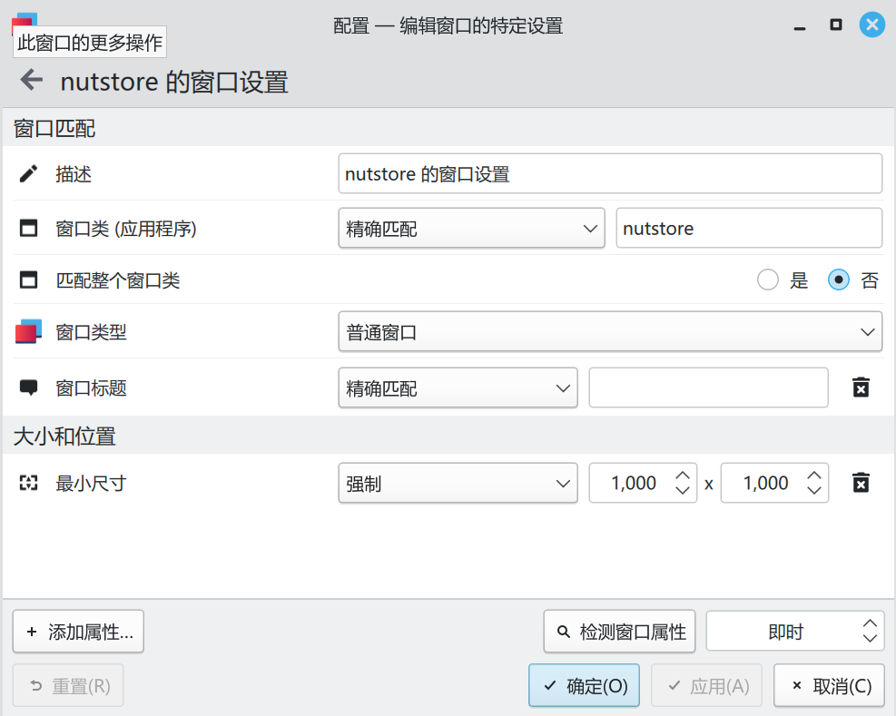
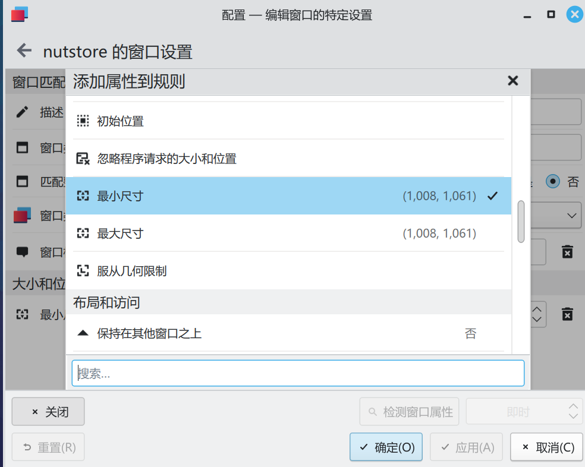
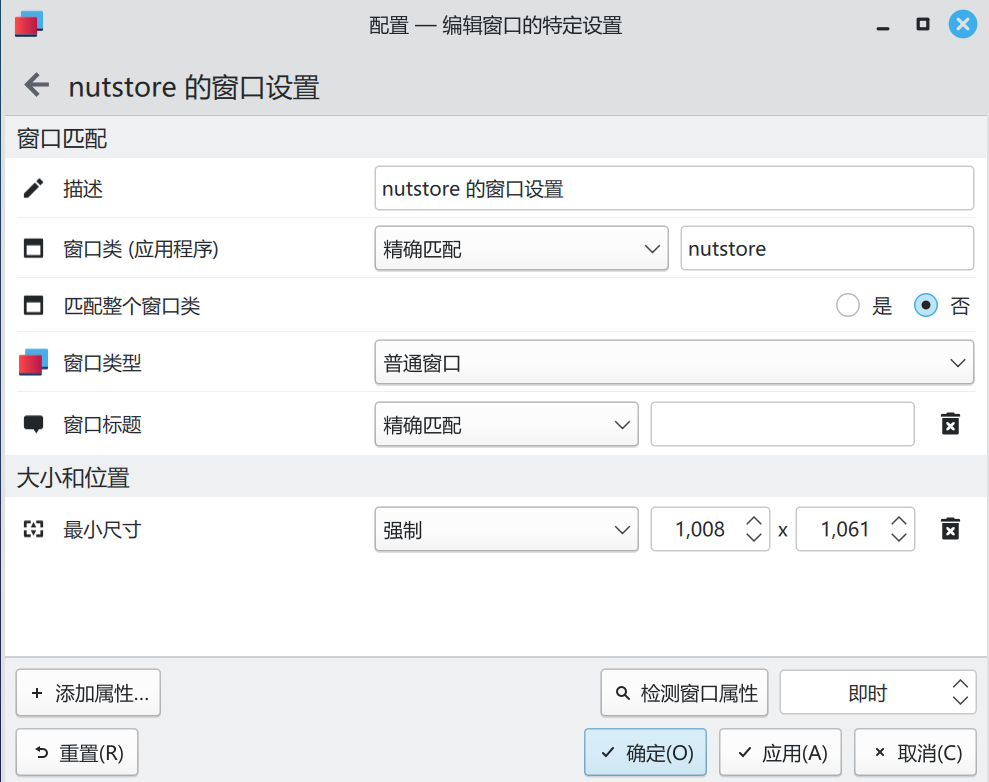

# 我的跨平台笔记方案-坚果云+Joplin

>笔记软件有很多,优秀的也不少。想找一个符合自己要求的跨平台笔记方案，难点在于**跨平台**这三个字，更确切的说是能够兼顾**Linux**平台。
---
历经一番波折，期间换来换去，最终找到了坚果云+Joplin这个终极跨平台笔记解决方案。
## 坚果云
坚果云可以说是所有网盘中对Linux的支持最优秀的了。

坚果云的Linux客户端拥有和windows、Mac下客户端完全一致的功能。

和Drobox相比，坚果云没有用户数的限制，只有流量限制。这个限制就很聪明，用来同步一些小文件完全够用，将来需要大空间了再花钱，也不贵。

## Joplin
Joplin是开源笔记软件的后起之秀，最大的优势是笔记可完全个人拥有。

和一些商业公司锁格式、锁导出等恶心行为相比，Joplin完全是笔记软件的清流，这也是为什么我喜欢开源软件。

Joplin的功能非常完备，支持图片、视频、表格、Markdown、代码、网页捕捉等，满足记笔记的一且需求。

## 整合方案
简单来说，就是坚果云开启WebDAV，然后把Joplin的笔记同步到坚果云的WebDAV里。

因为坚果云和Joplin都是全平台的，所有也就达成了跨平台体验一致的记笔记解决方案。

## 问题和解决
### KDE下坚果云登录界面太小的问题
主要体现在登录界面太小，以至于无法显示登录框的问题。

解决方法：

1、右键点击登录界面的标题栏--更多操作--配置特殊窗口设置

  

2、点击左下角`添加属性`

  

3、在弹出的`添加属性到规则`中，选择`最小尺寸`

  

4、选择强制，然后设置想要的大小，建设设置500以上，我这里是1008x1061

  

### Joplin同步到坚果云的正确方法
默认的话，Joplin通过WebDAV同步到坚果云会报错，大体意思是`太多的连接`这个错误。

解决方法：

首先在坚果云里新建一个个人同步文件夹，命名为“Joplin"，然后在软件设置的webdav地址里填入：

`https://dav.jianguoyun.com/dav/Joplin`

其他照旧就可以了。
