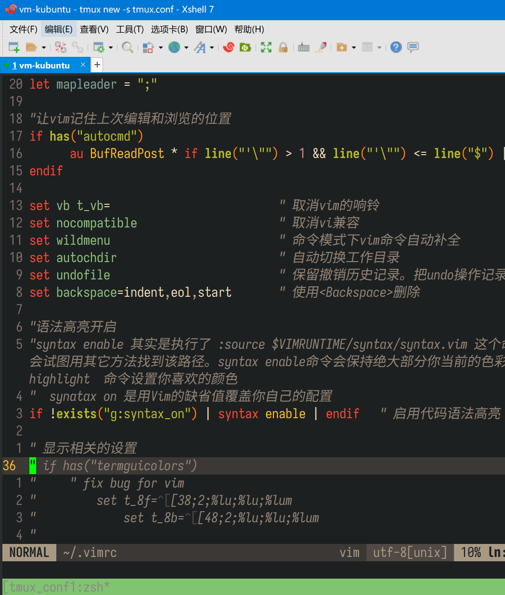

# 让tmux和vim支持TrueColor

> `TrueColor`就是24位的真彩色

软件版本：

- `tmux`：3.2
- `vim` ：8.2

## 修改终端的类型

> 终端的类型可以用 `echo $TERM`来确认。

默认情况下，`linux`系统的shell用的终端类型是 `xterm`，`tmux`用的终端类型是 `screen-256color`。

我们需要全部修改成 `xterm-256color`才能使`TrueColor`生效。 

> `secreen-256`最大的缺点是不支持斜体字。

### 修改系统shell的终端类型

假设用的是 `zsh`，则修改 `.zshrc`，在最后添加一行：

`export TERM="xterm-256color"`

然后 `source .zshrc`生效。

### 修改`tmux`的终端类型

打开`tmux`的配置文件 `~/.tmux.conf`

添加下面两行：

```
# 设置 tmux 的终端为xterm-256color
set -g default-terminal "xterm-256color"
# 开启 tmux 的终端的ture color支持
set-option -ga terminal-overrides ",xterm-256color:Tc"
```

## vim支持TrueColor设置

在`~/.vimrc`里添加下面一行

`set termguicolors      " 开启ture color,无需再设置set t_Co=256`

这样就可以了。

## TrueColor设置生效

以上修改操作做完后，需要
1. 退全部的`tmux`的`session`
2. 断开远程连接，重新登录

这样才能生效。

下面是在`tmux`里使用`vim`的截图，`vim`主题使用的是`gruvbox`:

  

