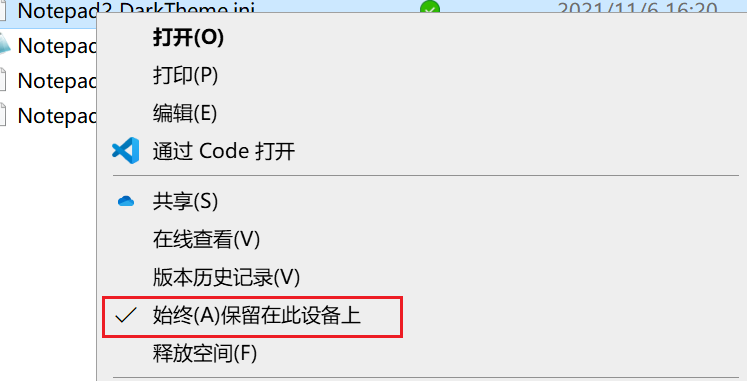
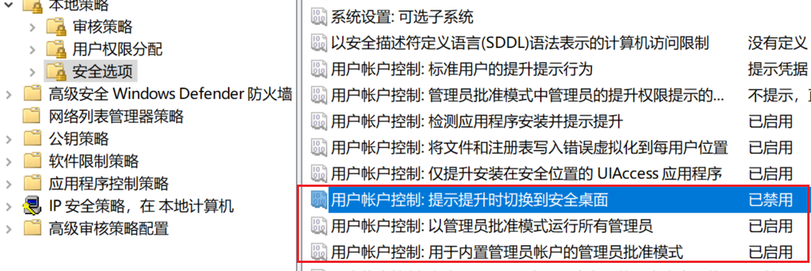

# 解决Windows Server 2022里OneDrive的同步问题

## 问题
在windows server 2022里，OneDrive可以正常安装使用，但是缺少了一项功能：

  

由于我把大量的绿色软件放在OneDrive里进行同步，在重装系统的时候，如果没有这个功能，所有软件得一个一个同步，就太麻烦了。

## 解决
一番搜索，找到了解决方法：

1. 修改安全配置
`win`+`R`，输入`secpol.msc`，选择 本地策略>>安全选项>>右边策略栏拉至用户账户控制相关配置，修改3个选项如下图：

  

2. 重置 OneDrive

打开`CMD`，输入下面命令：

`C：\Program Files\Microsoft OneDrive\onedrive.exe /rese`

重启之后，看到熟悉的`始终(A)保留在此设备上`就回来了。
