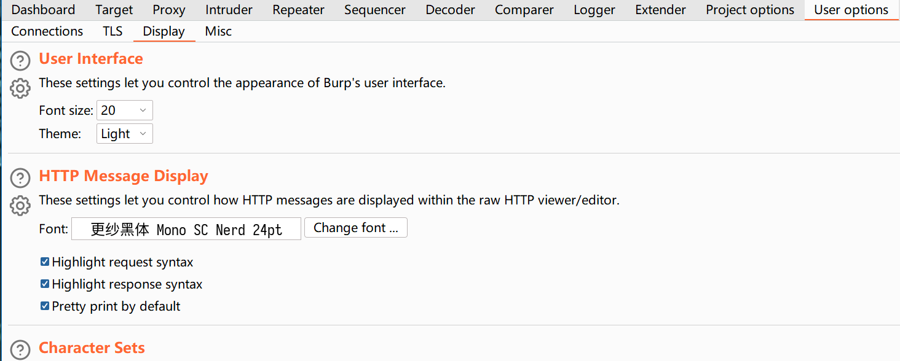

# 解决burpsuite在高分屏上字体模糊的问题

## 问题 

新版本的burpsuite在启动后，会根据系统的分辨率设置情况自动进行缩放，这带来2个问题：
1. 字体界面变得模糊
2. 在reapter等界面中，选择字体时鼠标会乱动，导致选不准。

## 解决

要解决要很简单，在burpsuite的启动命令中加上下面的参数即可：
 `-Dsun.java2d.uiScale=1` 

完整的命令类似于下面：
`java --illegal-access=permit -Dfile.encoding=utf-8 -noverify -Dsun.java2d.uiScale=1 -javaagent:BurpSuiteLoader.jar -jar burpsuite_pro_org.jar`

重启后，需要在`User options`-->`Display`中把字体调大，一般4K屏20号字体比较不错。

还有一个好处是,render中的字体也不再模糊了。

另外等宽字体推荐使用`更纱黑体 mono sc nerd`
  
