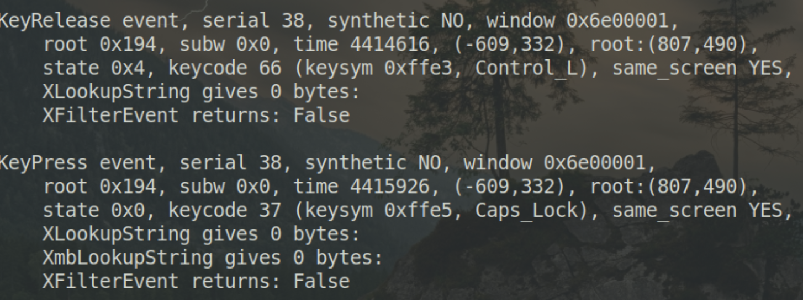

# Vmware在Linux作为Host下的键盘映射的问题

长久以来，在 Linux 使用 vmware 总是有个问题没有解决。

当在 Linux 里把 Ctrl 和 CapsLock 这两个键互换后，vmware 的虚拟机里并不会跟着一起换，而依旧是原来的键位。而同样的问题在 Windows 下就不存在。

vmware 的官方文档解释：
>> Workstation Player 可通过检查当前的 X 键映射确定要使用的表。但这种决策过程有时也会失败。另外，每个映射都是固定的，不保证对任何给定的键盘和 X 按键代码-键盘符号映射都正确无误。例如，如果用户使用 xmodmap 互换 Ctrl 和 CapsLock 按键，那么在使用远程服务器时虚拟机中的按键将互换（键盘符号映射），但在使用本地服务器时将取消互换（按键代码映射）。为了修正此问题，您必须在 Workstation Player 中重新映射按键。

也就是说，在本机上修改了键位后，远程连接到 vmware 虚拟机里是正常的，但是在本机上的虚拟机里则不能使用。

## 解决方案

官方给出的解决方案是：

### 查看特定键位的值

使用xev或者xmodmap -pk查看 Ctrl 和 CapsLock 的键位值

  

可以看出，left Ctrl 键的值是 66,而 CapsLock 键的值是 37

### 查看键位对应的 V-Scan 值

需要到V-Scan Code Table去查看。

这里直接告诉大家： Left Ctrl 的值是 0x01d CapsLock 的值是 0x03a

### 添加配置文件

在`~/.vmware/config`（没有就新建一个）里添加如下配置：

```
xkeymap.keycode.66 = 0x01d
xkeymap.keycode.37 = 0x03a

```
至此，工作全部完成，vmware 里的虚拟机可以使用和 Host 一样的键位设置了。

### 踩过的大坑

这么简单的一个问题，官方文档有明确的说明了，为什么拖了好几年没解决呢？

主要问题有两个：

1. 官方的文档里说，更改健位值的两行代码，加在虚拟机配置文件里(.vmx)或者`~/.vmware/config`都可以，其实不对。这两行代码只能加在`~/.vmware/config`，加在其他地方不起作用。这个坑是长期未解决此问题的主要原因。

2. 添加这两行配置后，必须重新启动系统，以便让修改生效。

