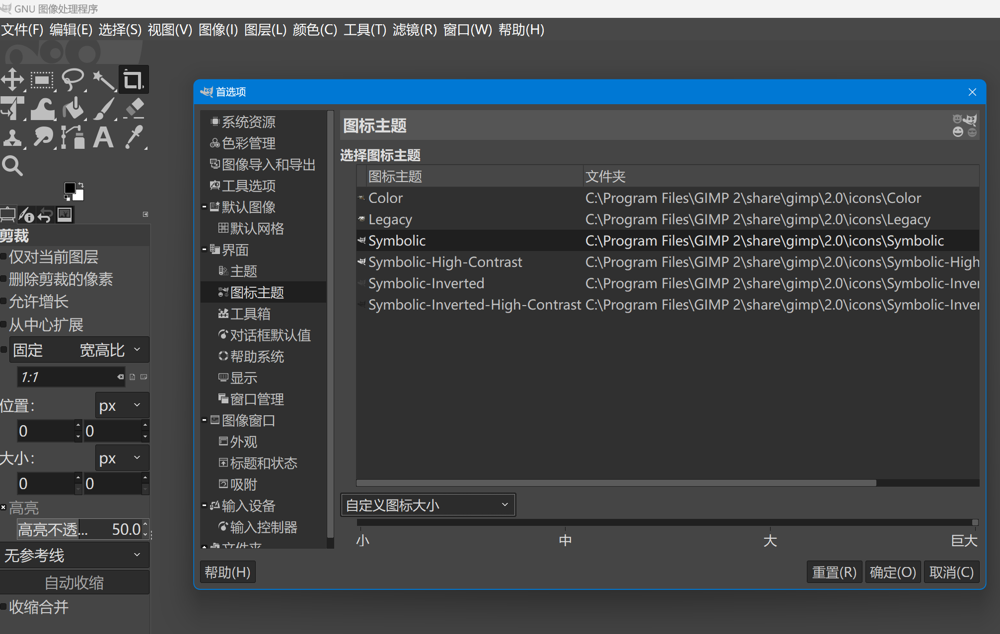

# Windows下调整GIMP的字体和图标的大小

在windows下，4K屏幕上,gimp默认显示的图标和字体太小了,字体也不好看,下面介绍如何调整字体类型和大小,以及图标的大小.

这里以gimp默认的Dark主题为例,其它主题类似

## 调整字体类型和大小

打开`C:\Program Files\GIMP 2\share\gimp\2.0\themes\Dark`文件夹,编辑`gtkrc`这个文件

1. 找到61行

```
#gtk-font-name = "Sans 11"

```

修改成下面的样子:

```
gtk-font-name = "Microsoft YaHei UI 12"
```

2. 找到68行

```
#  font_name = "Sans 11"
```

修改成下面的样子

```
font_name = "Microsoft YaHei UI 12"
```

其中,`Microsoft YaHei UI`是字体类型,`12`是字体大小
3. 找到115行

```
  #GimpDock::font-scale = 0.8333
```

修改成下面的样子

```
 GimpDock::font-scale = 1.1111
```

其中`1.1111`是缩放的比例,根据自己的屏幕实际情况来调整.

## 调整图标大小

打开gimp,找到`编辑`-`首选项`-`界面`-`图标主题`

找到下方的`通过分辨率猜测图标大小`,修改成`自定义图标大小`,然后把下方的滑块拉到最右边`巨大`。

这样图标大小就调整好了。

以上这些参数都可以根据自己的屏幕大小和个人喜好，随意自己调整。

## 实际效果
下面放一张27寸4K分辨率168%缩放下，使用文中提到的参数的显示效果：


