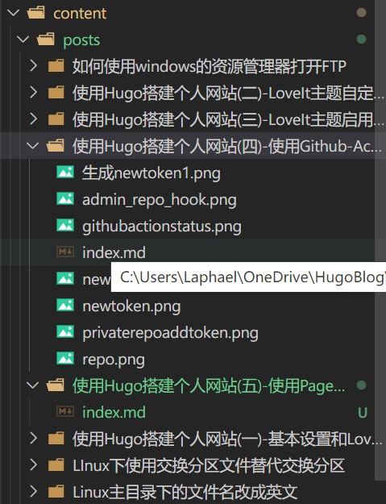

# 使用Hugo搭建个人网站(五) 使用Page Bundles组织网站内容

什么是`Page Bundles`呢,官方网站的解释在[这里](https://gohugo.io/content-management/page-bundles/)

简单来说,一般的Hugo网站,每篇文章是一个以文章名称命令的`.md`格式的文档，保存在`content/posts`目录下，文章中所有的资源-图片、视频、PDF等附件，都保存在根目录的`static`目录里。

这种做法的缺点是，所有文章的附件都在一个目录里，管理上非常混乱，分不清哪个图片或者附件是属于哪篇文章的。而且在本地预览时，因为图片链接格式的原因，还会遇到无法正常显示图片的问题。

而`Page Bundles`则解决了这些问题：
1. 新建文章时，会在`content/posts`目录下创建一个以文章名命令的目录，目录下的`index.md`才是文章的本体。
2. 文章所有涉及的附件，都保存在`index.md`的同级目录下。

看下图

如果使用vscode管理编辑Hugo网站，还有插件能很简单的实现`Page Bundles`的组织形式。下篇再讲。

在这里推荐`Page Bundles`的网站组织形式，会使网站的文章和附件管理非常的有组织性。

