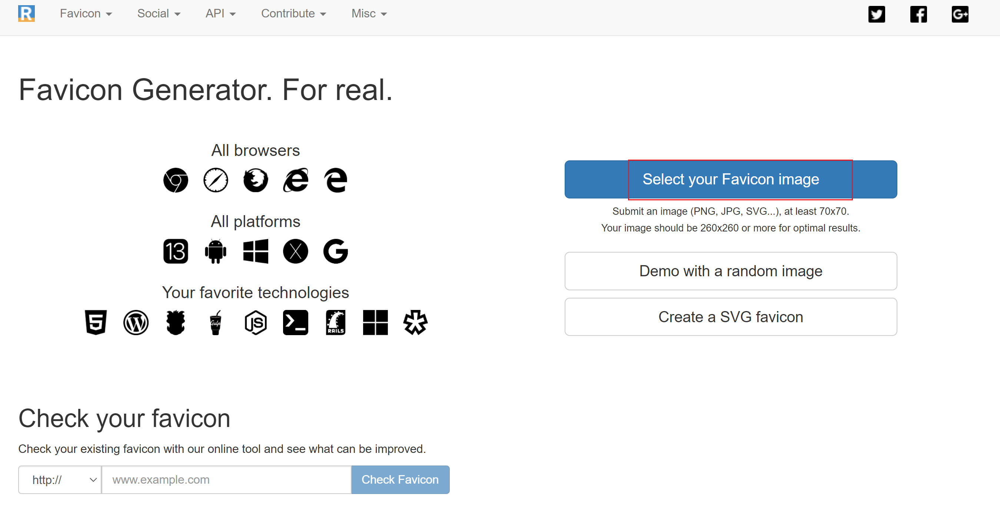
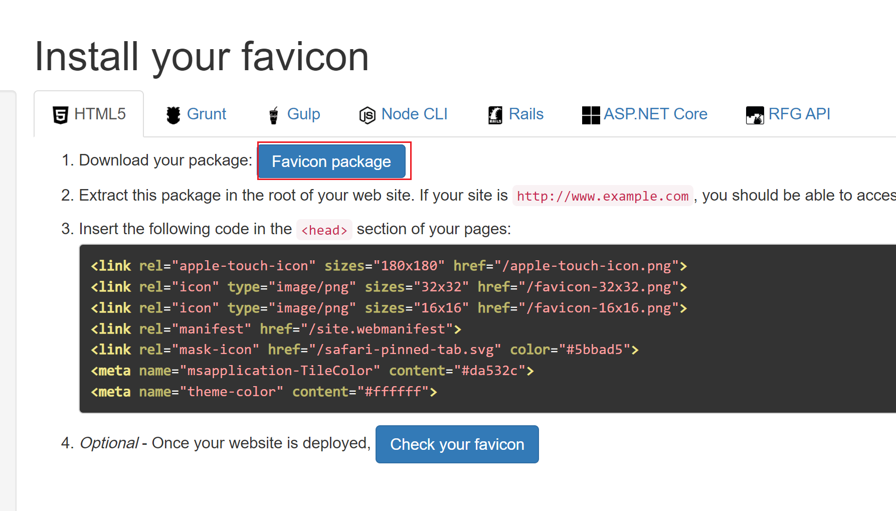

# 使用Hugo搭建个人网站(三)-LoveIt主题启用网站图标

网站图标`favicon`,虽然对于网站不是必须的，但是有这个东西能显著增加网站的正规性和美观性。

## 生成favicon
打开[realfavicongenerator](https://realfavicongenerator.net/),点击右上角`Select your Favicon image`链接。

  

这时会打开对话框，让你选择一张图片，等待完成即可。

完成后，会出现下载链接，点击下载即可。

## 启用favicon
把下载的文件，全部解压到网站根目录的`static`中。

因为LoveIt主题自带了对realfavicongenerator生成的favicon格式支持，所以不用再做其它设置，直接就生效。
