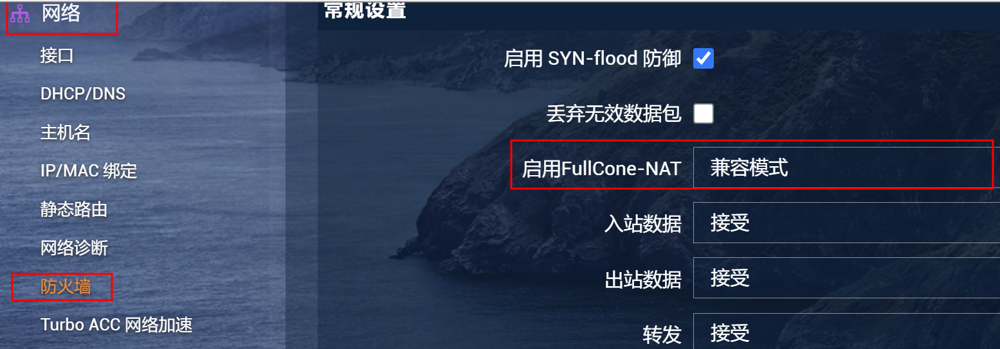

# 解决openwrt软路由下两个客户端不通的问题

> 前段时间把家庭网络改造了一下:

1. 自己编译了openwrt软路由
2. 一直以来的`ikuai`+`openwrt旁路由`模式，改成了只使用1个openwrt主路由，

## 问题

改造完后,所有功能一切正常,唯独本地的两个主机:电脑和NAS之间不能使用`zerotier`互通了，而本地电脑连接到外网的moon服务器和连接到zerotier账户一切正常。

## 过程

在网上找解决方案，发现都是在`openwrt`上安装`zerotier`的互通解决方案。

而我的需求不同。我没有在`openwrt`上安装`zerotier`，只是希望`openwrt`下的客户端能够互通。

所有网上的解决方案对我来说都没有用。

## 解决方法

解决方法非常简单，在`openwrt`-防火墙下，把`启用FullCone-NAT`从`高性能模式`改成`兼容模式`就可以了。
  

原理我不清楚，怀疑是`FullCone-NA`兼容性的问题。

