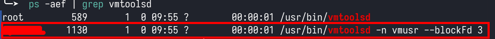

# 解决KDE桌面在vmware中的复制、粘贴和拖拽文件的问题

## 问题描述
在vmware中安装linux的虚拟机，做了以下工作之后：
1. 虚拟机使用的是kde桌面
2. 虚拟机已经安装了`open-vm-tolls`和`open-vm-tools-desktop`
3. 在虚拟机的高级选项中启用了拖放和复制粘贴等功能

依然不能和宿主机之间双向复制、粘贴和拖放文件。

本人使用vmware安装kali Linux，使用的是KDE桌面，就出现了上面的问题。

## 原因 
这是KDE桌面的一个bug
当运行`ps -aef | grep vmtoolsd`后，**并不会**出现类似下图中的第2行红框中的`/usr/bin/vmtoolsd -n vmusr --blockFd 3`的结果：
  

这就是导致不能复制、粘贴和拖放的原因

## 解决方法
1. 新建一个文件`startkderc`
```
sudo vi /etc/xdg/startkderc
```
添加以下内容并保存：
```
[General]
systemdBoot=false
```
2. 添加`vmware-user-suid-wrapper`到kde的自动启动
系统设置--开机与关机--自动启动--添加--添加应用程序，在弹出的对话框中输入`/usr/bin/vmware-user-suid-wrapper`
3. 重新启动，问题解决

## 延伸阅读
相关讨论的原文在[这里](https://github.com/vmware/open-vm-tools/issues/568)。

另外提一点，在帖子中有人对fedora、archlinux和opensuse都做了测试，发现只有opensuse默认状态下一切功能正常。看来opensuse还是有点东西的😊
