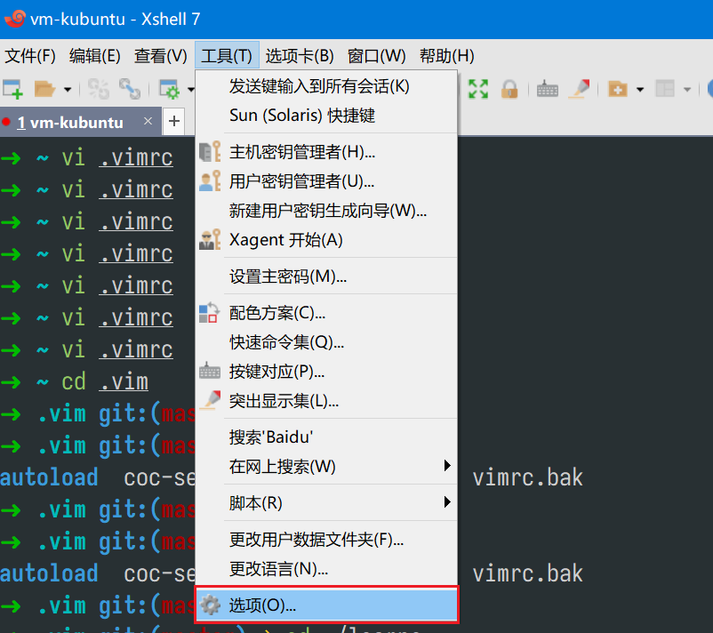
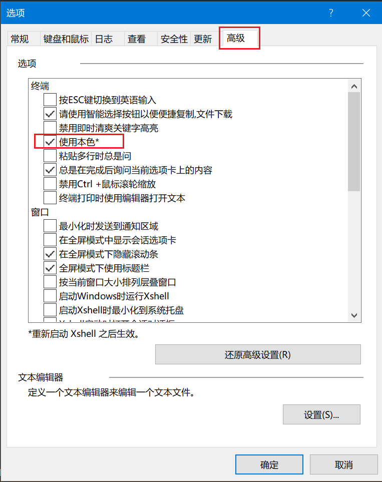
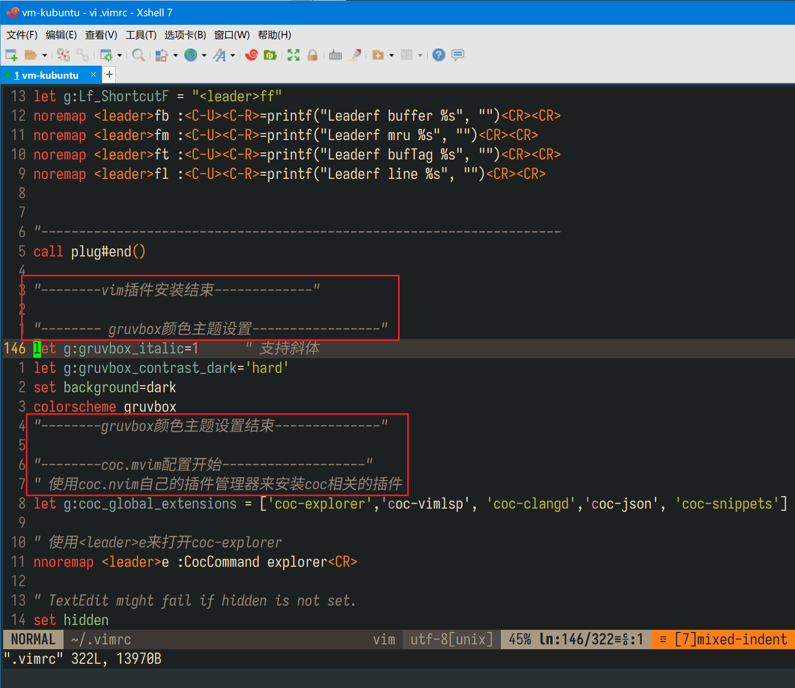

# Xshell确实好用

最近在学习C语言编程，准备采用下面方法：

- `windows 10`的主机，装一台`kubuntu 22.04`的虚拟机
- `windows`下使用远程工具连接到虚拟机。
- 使用`vim`来编辑和编译。

> 据说这是大厂常用的工作流程

远程连接工具其实没有太多的选择，常用的也就三个：`Xshell`、`SecureCRT`、`MobaXterm`。

这三个我都用过，总是因为某些原因从一个换到另一个，具体什么原因自己都忘了。

这次在远程连接到虚拟机上配置vim的时候，才发现了Xshell的强大和方便之处。难怪有那么多人推荐Xshell。

三款终端使用的版本号如下：Xshell 7、MobaXterm 22.1、SecureCRT 8.5 & 9.2

## 一、TrueColor的支持

所谓的`TrueColor`，也就是24位真彩色，这个色彩在物理显示器上，也就是2000年初的水平。

但是在终端上，多年流行的都是`xterm 256`的颜色，直到最近几年才有终端开始支持。

> 其实xterm 256也够用了

对于`TrueColor`的支持情况，三款终端如下：

- `MobaXterm`：支持
- SecureCRT：8.7版本之后支持
- `Xshell  `：支持

### （一）打开Xshell 7的TrueColor支持

工具--->选项--->高级--->终端--->选中"使用本色”，就可以了。如下图：

## 二、斜体的显示支持

我使用的`vim`主题叫`gruvbox`，这个主题可以打开斜体显示功能。默认情况下注释内容会用斜体显示。

同样的.`vimrc`配置文件，在`SecureCRT`和`MobaXterm`里，都没有办法打开斜体显示，而`Xshell`显示正常：

## 三、Zmodem支持

`Zmodem`，简单来说就是可以使用`sz`、`rz`命令从远程主机和本地主机之间传输文件。

`Xshell`和`SecureCRT`默认支持，`MobaXterm`需要安装插件才支持。

> 其实`Xshell`有`xftp`，`SecureCRT`有`SecureFX`，`MobaXterm`在连到远程主机时也会自动打开一个sftp传输窗口，都可以替代`Zmodem`的功能。
>
> 但是有`Zmodem`支持总是好的，可以很方便的传输一些配置文件。

## 四、多主机同时运行相同命令

这个功能在做运维的时候，同时管理多台主机很有用。

Xshell按下ALT+e,就可以把命令同时在所有打开并连接的远程主机中执行了.

SecureCRT有也类似的功能，但是不如Xshell方便。

MobaXterm没有试过。

## 五、总结

网上有这么多人推荐Xshell，不是没有原因。

很多功能，在你没用到之前，会觉得所有远程终端都一样。

很多想要功能，在没踩过坑前，不会知道它有没有实现。

目前为止，Xshell是最满足我需要的一个远程终端程序了。

如果没有特殊原因，以后不会再换了。

