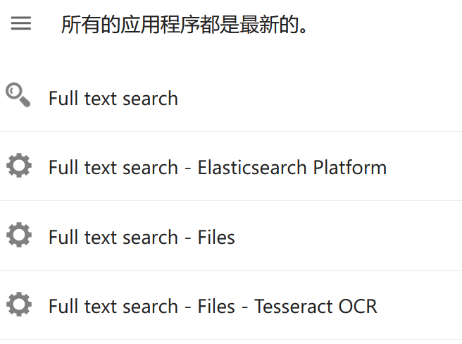
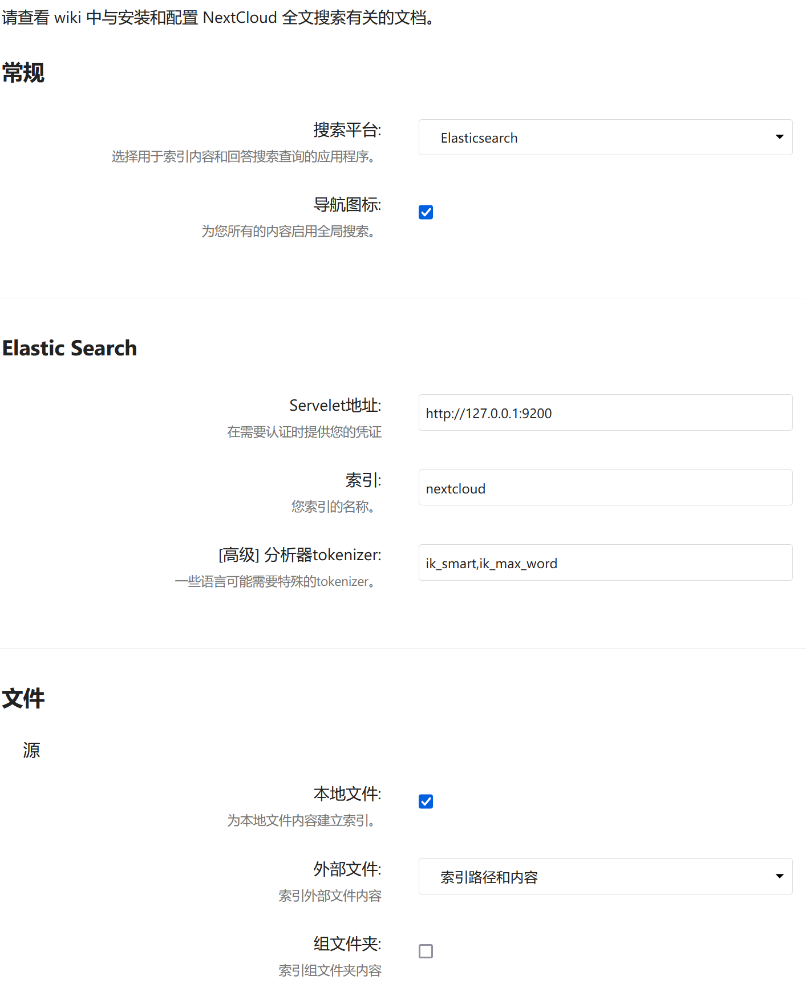
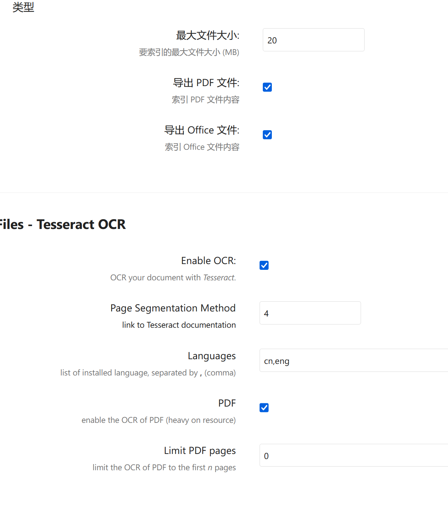

# 为nextcloud安装elasticsearch全文搜索

>写作本文时,elasticsearch 8.3.4版本已经发布，无奈此版本与nextcloud集成的文章太少，因此还是使用elastic7。实际使用效果非常好。

## 环境相关
CPU:2核
内存:4G
操作系统: ubuntu 22.04 server
java: openjdk-11-jdk
php: 8.1
elasticsearch: 7.17.6
nextcloud:24.0.6

## 安装java
elasticsearch依赖于java

```
sudo apt install openjdk-11-jdk
```

## 安装elasticsearch
这里采用直接下载安装包来本地安装的方式。

原因是elasticsearch的中文分词插件`elasticsearch-analysis-ik`只有7.17.6版本。如果使用apt的方式安装会直接安装7.17.7版本，从而不匹配而无法使用。

这也是为什么会安装`elasticsearch` `7.17.6`版本的原因。

### 下载
```
wget https://artifacts.elastic.co/downloads/elasticsearch/elasticsearch-7.17.6-amd64.deb
```

### 安装
```
sudo dpkg -i elasticsearch-7.17.6-amd64.deb 
```

### 配置
```
 vi /etc/elasticsearch/elasticsearch.yml
```
在56行左右，修改成下面的形式：
```
network.host: localhost
```

### 设置开机启动

```
sudo systemctl start elasticsearch

sudo systemctl enable elasticsearch
```

### 测试

```
curl -X GET "localhost:9200"
```
输出类似于下面：
```
{
  "name" : "myhostname",
  "cluster_name" : "elasticsearch",
  "cluster_uuid" : "T6xlz9vrRe7qE9D8U4We6Q",
  "version" : {
    "number" : "7.17.6",
    "build_flavor" : "default",
    "build_type" : "deb",
    "build_hash" : "f65e1yt67dc1d07b642e14a27f338990148ee5b6",
    "build_date" : "2022-08-23T11:08:48.893373482Z",
    "build_snapshot" : false,
    "lucene_version" : "8.11.1",
    "minimum_wire_compatibility_version" : "6.8.0",
    "minimum_index_compatibility_version" : "6.0.0-beta1"
  },
  "tagline" : "You Know, for Search"
}
```
并不需要网上说的用户名和密码什么的。

### 安装中文插件

1. ingest-attachment
```
/usr/share/elasticsearch/bin/elasticsearch-plugin install ingest-attachment
```
2. ik分词插件
```
/usr/share/elasticsearch/bin/elasticsearch-plugin install https://github.com/medcl/elasticsearch-analysis-ik/releases/download/v7.17.6/elasticsearch-analysis-ik-7.17.6.zip
```
## nextcloud设置

### 安装搜索相关插件

full text开头的那几个，如下图几个：
  

### 设置插件

打开设置-全文搜索,如下图配置
  

  

### 生成索引

进入到nextcloud的安装目录下,例如`/var/www/nextcloud`
```
cd /var/www/nextcloud
```
运行命令：
```
sudo -u www-data php ./occ fulltextsearch:index
```
这时，可以去nextcloud里试试全文搜索了。

## 额外的工作

创建elasticsearch的索引服务，并开机自动启动

```
sudo vi /etc/systemd/system/nextcloud-fulltext-elasticsearch-worker.service
```
输入如下内容：
```
[Unit]
Description=Elasticsearch Worker for Nextcloud Fulltext Search
After=network.target

[Service]
User=www-data
Group=www-data
WorkingDirectory=/var/www/nextcloud
ExecStart=/usr/bin/php /var/www/nextcloud/occ fulltextsearch:live -q
ExecStop=/usr/bin/php /var/www/nextcloud/occ fulltextsearch:stop
Nice=19
Restart=always

[Install]
WantedBy=multi-user.target
```
开机自启动设置：
```
systemctl enable nextcloud-fulltext-elasticsearch-worker.service

systemctl start nextcloud-fulltext-elasticsearch-worker.service
```
全部安装配置完成。
