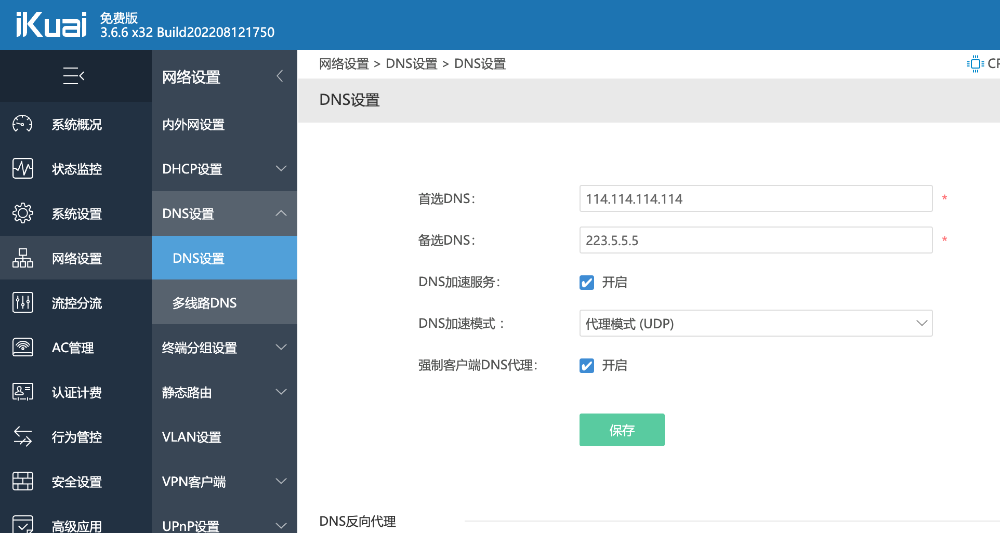

# IKuai的DNS设置

这几天黑苹果终于是折腾完美了，但是有一个问题：

在黑苹果里打开网页非常的慢，而且打开网站后，再点击网站里的链接也是非常慢。

切换到Windows系统里测试了一上，快了一点，但是也没有达到秒开的地步。

这是非常不应该的。我家里的是千兆宽带，打开的也是sohu、ifeng之类的大站，DNS用的也是114，怎么会打开个网页也慢呢？

作为一个网络行业相关人员，第一时间就怀疑到了DNS上。

家里用的是软路由，使用的是ikuai虚拟机。一番折腾后，找到了问题的答案。

在ikuai-网络设置-DNS设置里，有一个`DNS加速模式`。

我原本的设置是`代理模式（DoH:DNS Over Https）`,把它改成`代理模式（UDP)`就可以了。
  

这样打开任何国内的大站，都是秒开的效果。

问题解决。

