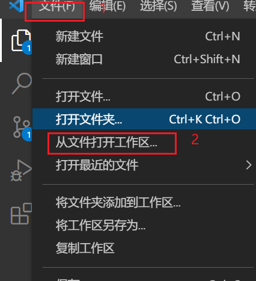
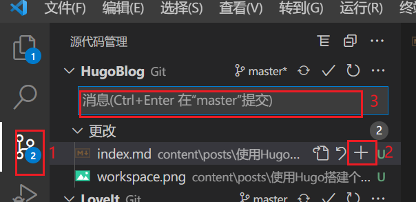

# 使用Hugo搭建个人网站(六) 编辑文章和管理网站

`Hugo`的本质就是把`.md`格式的文章通过一套引擎渲染成`.html`页面。

因为这个过程是全自动化的，所以编辑网站文章就是编辑本地的`.md`文章。

`Visual Studio Code`(简称`vscode`)，集成了Git以及编辑markdown的插件，同时也有Hugo相关的插件，成为了我认为最适合编辑和管理Hugo网站的编辑器。

## VSCode
### 插件
- Markdown All in One  此插件主要提供了新建/提升/降级标题的等级的快捷键.
- Markdown Shotcuts    此插件主要是提供了粗体、斜体、行内代码、代码块的快捷键。
- Markdown Paste       此插件主要是提供了直接向`md`文章里贴图的功能.
- Hugofy(荒野無燈版)     此插件主要是提供了新建文章时直接使用[Hugo Page Bundles](https://dnwzlx.com/posts/b085eb84/)的方式.
  
有了以上四个插件,编辑Hugo网站直接起飞。

### workspace
`vscode`有个模仿是`workspace`。在某个目录下添加一个名为`workspace.code-workspace`的文件，就可以把整个目录当成一个工作区。

而且这个`workspace.code-workspace`文件是自动创建的。

### Git上传
当有文件变更时：

1. 点击左侧的Git图标
2. 点击+号
3. 在输入框里输入commit的内容
4. 点击同步

## OneDrive
算是一个技巧吧。

把Hugo的本地网站放在`OneDrive`里同步，

- Github之外，又多了一份备份
- 省去了在不同电脑间编辑时，`git pull`等git的同步操作。

通过上面这些设置，可以在一个环境里进行Hugo编辑、管理的全部操作，而且步骤简单。

让我们把精力全部放在网站内容上。

