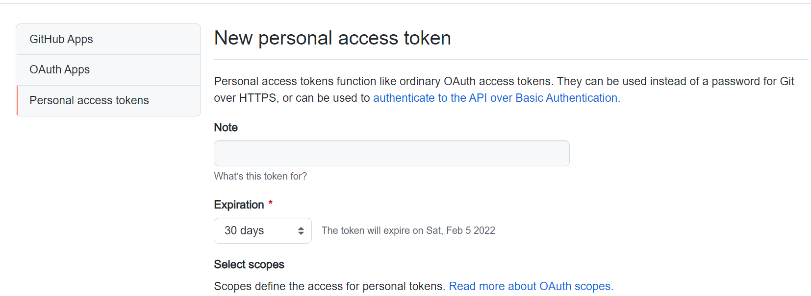
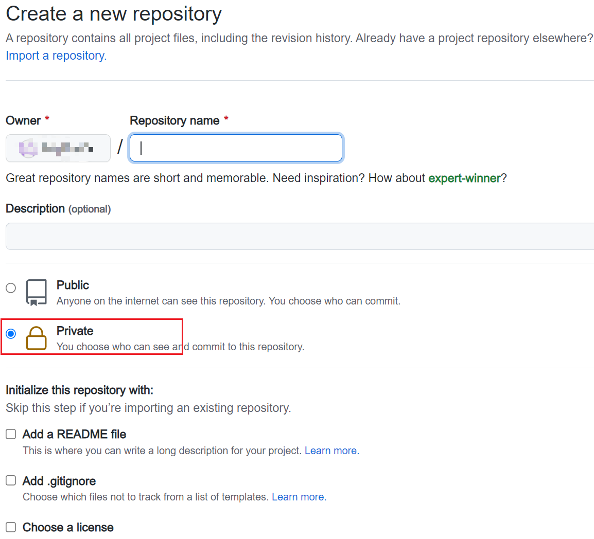
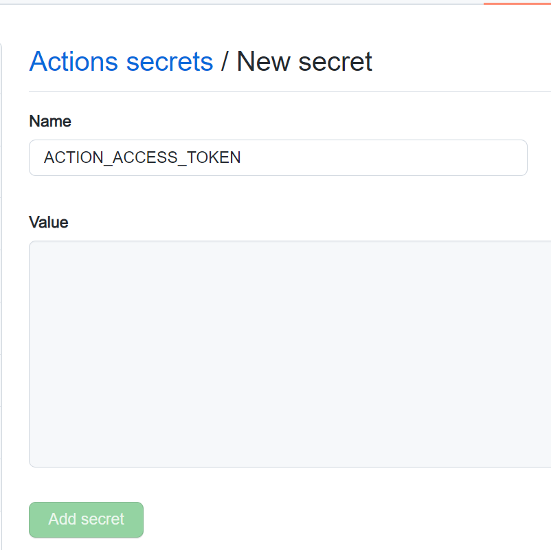
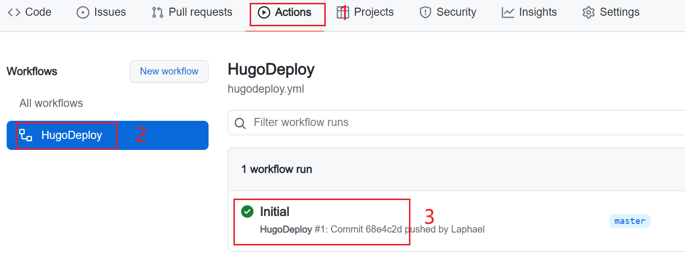

# 使用Hugo搭建个人网站(四)-使用Github Action自动部署到Github Pages

部署网站到Github上使用的是`Github Page`功能。

一般来说，部署Hugo网站到`Github Page`的流程是这样的：
1. 新建一个`Github Page`的repo
2. 把网站源码部署到repo的一个分支，比如`source`
3. 把网站的public文件部署到repo的`master`分支

这种方法能同时备份网站源码和网站，但也有不足之处:
1. 网站源码和生成的网站都处于公共分支,任何人都能查看
2. 每次更新网站,得同时更新网站源码和生成网站,比较繁琐

因此,本文介绍如何使用`Github Action`,解决上面的两个不足之处。

## 基本思路
1. 新建一个private repo（私人仓库）,用于保存网站源码
2. 设置`Github Action`,每当private repo有提交时，就自动监测源码的变化、自动生成网站且自动发布到`Github Page`上。

这样，每次只需把网站源码提交到private repo就可以了，剩下的所有工作由`Github Action`来自动完成。

## Github Action设置
### 生成Personal access tokens
由于源码是保存在私人仓库的，这里需要使用`Personal access tokens`来具备改写别的repo的权限。

点击头像下拉菜单-`Settings`-`Developer Settings`-`Personal access tokens`。

点击右侧的`generate new token`

名字随便填,比如`ACTION_ACCESS_TOKEN`

下方`repo`的所有选项全部选上:  


还有admin:repo_hook,全部选上:  
  
生成的`token`保存好备用
## 私人仓库设置
新建一个私人仓库,名字随意  
  
在此repo上，`Settings`-`Secrets`-`New repository secret`
  
把刚才申请的`Personal access tokens`填写上。
`Name`必须和刚才申请`Personal access tokens`时填写的一致，比如`ACTION_ACCESS_TOKEN`  


## 网站设置
在网站根目录里新建两个文件夹`.github/workflows`。

在`workflows`里新建一个后缀为`.yml`的文件，比如`hugodeploy.yml`(文件名自己随便取)。

`hugodeploy.yml`的内容如下:
```yml
name: HugoDeploy 

on:
  push:
    branches:
      - master  # 这里的意思是当 master分支发生push的时候，运行下面的jobs，这里先改为github-actions

jobs:
  deploy: # 任务名自取
    runs-on: ubuntu-20.04	# 在什么环境运行任务
    steps:
      - uses: actions/checkout@v2	# 引用actions/checkout这个action，与所在的github仓库同名
        with:
          submodules: true  # Fetch Hugo themes (true OR recursive) 获取submodule主题
          fetch-depth: 0    # Fetch all history for .GitInfo and .Lastmod

      - name: Setup Hugo	# 步骤名自取
        uses: peaceiris/actions-hugo@v2	# hugo官方提供的action，用于在任务环境中获取hugo
        with:
          hugo-version: '0.91.2'	# 获取最新版本的hugo
          extended: true

      - name: Build
        run: hugo --minify	# 使用hugo构建静态网页

      - name: Deploy
        uses: peaceiris/actions-gh-pages@v3	# 一个自动发布github pages的action
        with:
          # github_token: ${{ secrets.GITHUB_TOKEN }} 该项适用于发布到源码相同repo的情况，不能用于发布到其他repo
          external_repository: yourname/yourname.github.io	# 发布到哪个repo
          personal_token: ${{ secrets.ACTION_ACCESS_TOKEN }}	# 发布到其他repo需要提供上面生成的personal access token
          publish_dir: ./public	# 注意这里指的是要发布哪个文件夹的内容，而不是指发布到目的仓库的什么位置，因为hugo默认生成静态网页到public文件夹，所以这里发布public文件夹里的内容
          publish_branch: master	# 发布到哪个branch
```
需要改动的就是30和31两行:

`external_repository`: 填写自己的Github Page仓库地址  
`secrets.ACTION_ACCESS_TOKEN`里的`ACTION_ACCESS_TOKEN`,改成你申请时token时填写的名字。

## 部署到Github
网站根目录下,执行下面命令，部署到远程私人仓库
```
git remote add origin https://github.com/your_private_repo
git add .
git commit -m "Initial"
git push -u origin master
```
**注意**：`git commit`后面的`"Initial"`就是单次执行`Github Action`的任务名称。

## 查看运行情况
到私有仓库，点击`Actions`，查看`Github Action`的运行情况。


一切正常的话，在你的`Github Page`仓库里就能看到生成的网站了。


